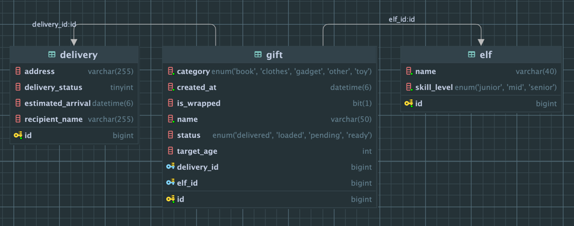

# Santa-s-Workshop-API
This app is made to cover exam criteria of Sirma Academy in module Spring - Rest

Notes for last:
1. Database is created if not exist. If user do not want to create database its need to remove this text (?createDatabaseIfNotExist=true) from line 3 in application.properties file.
2. In order to start the app user needs to add env variable in his project for DB_PASSWORD, or to replace DB_PASSWORD with his MYSQL password and to replace username root with his username for MYSQL. This two fields are in application.properties file.
3. Application will run on port 8080, if user wants to change the part, it can do it in application.properties file at row 8.
4. Mapstruct dependency is added to this project and setup of IDE is needed. In intellij Settings --> Build, Execution, Deployment --> Compiler --> Annotation Processors --> Select "Enable annotation processing" checkmark and select "Obtain processor from project class path".
5. I change in entities fields that will be connected for ID`s. From List\<Long> to Set\<Gift> idea is to have managing of the gifts my JPA not manually by me. But I know how to do it. Just it will cost more process time to be done, because i need to manage and update both tables in my database. And many errors can apear from manual managing of database. 
   1. I think this One to many connections is better. And managing of the database will be easy.
6. 

Validation for gift is done and body needs to look like this: 
{
"name": "12",
"category": "GADGET",
"targetAge": "10",
"isWrapped":"true"
}
If some of the fields are NOK handling will be trigger. 
